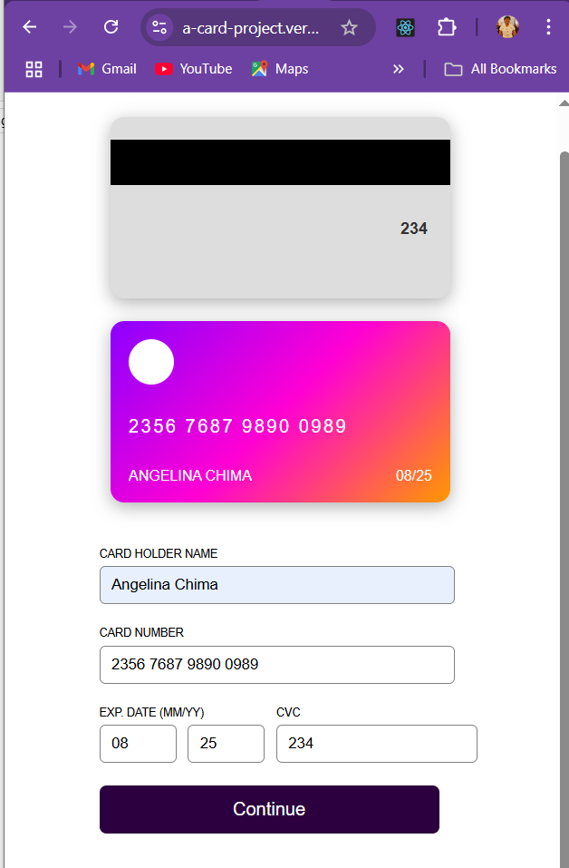

# Frontend Mentor - Interactive Card Details Form Solution

This is my solution to the [Interactive Card Details Form challenge on Frontend Mentor](https://www.frontendmentor.io/challenges/interactive-card-details-form-XpS8cKZDWw). The goal was to build a visually appealing and interactive credit card form that validates user input and displays real-time feedback — all while staying responsive across different devices.

## Table of contents

- [Overview](#overview)
  - [The Challenge](#the-challenge)
  - [Screenshots](#screenshots)
  - [Links](#links)
- [My Process](#my-process)
  - [Built With](#built-with)
  - [Features](#features)
  - [What I Learned](#what-i-learned)
  - [Continued Development](#continued-development)
  - [Useful Resources](#useful-resources)
- [Author](#author)

---

## Overview

### The Challenge

Users should be able to:

- Fill in the form and see the card details update in real time
- Receive validation messages for:
  - Empty input fields
  - Incorrect formats (e.g., card number not 16 digits, CVC not 3 digits)
- Submit successfully and see a thank-you screen
- View the correct layout based on device size (mobile/desktop)
- Experience transitions and hover/focus states for interactive elements

### Screenshots

| Mobile Design | Complete State |
|---------------|----------------|
|   |
| |

### Links

- **Live Site URL:** [https://a-project.vercel.app](https://a-project.vercel.app)
- **Solution GitHub Repo:** [https://github.com/Git-Angel/A_Card_Project](https://github.com/Git-Angel/A_Card_Project)

---

## My Process

### Built With

- Semantic HTML5
- CSS custom properties
- Flexbox
- Media queries
- [React](https://reactjs.org/)
- [Vite](https://vitejs.dev/)
- [TypeScript](https://www.typescriptlang.org/)
- React Router (`react-router-dom`)
- Local component state and props
- Form validation logic using TypeScript
- [Google Fonts - Space Grotesk](https://fonts.google.com/specimen/Space+Grotesk)

### Features

- Live card preview with masked number format
- Smooth page transitions using `react-router-dom`
- Success confirmation message after submission
- Fully responsive design for both desktop and mobile views
- Clean and simple code structure for easy scalability

### What I Learned

- How to implement real-time input formatting in React
- Managing form state and input validation using TypeScript
- Handling routing between pages with React Router
- Creating reusable components for layout and logic separation
- Styling with plain CSS while maintaining responsiveness

### Continued Development

Areas I’d like to explore more:

- Adding unit tests for validation logic
- Extracting form input components for better reusability
- Adding accessibility features like ARIA attributes and keyboard support

### Useful Resources

- [React Docs](https://reactjs.org/docs/getting-started.html)
- [MDN Web Docs - CSS Flexbox](https://developer.mozilla.org/en-US/docs/Web/CSS/CSS_flexible_box_layout)
- [Vite Documentation](https://vitejs.dev/)
- [Space Grotesk Font](https://fonts.google.com/specimen/Space+Grotesk)

---

## Author

- GitHub – [@Git-Angel](https://github.com/Git-Angel)

---
